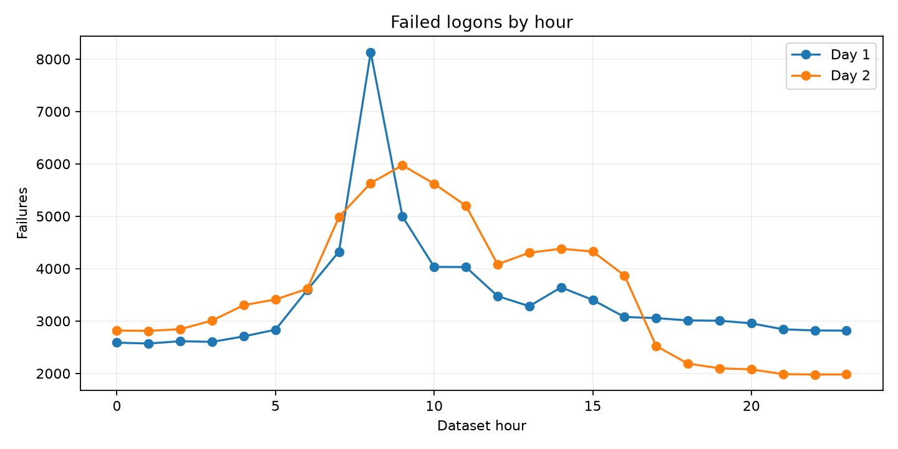

# Identity and Login Anomaly SQL Analytics

Eighteen SQL questions and an interactive dashboard over anonymized User-prefixed account Windows logon events from the [LANL Unified Host and Network Dataset](https://csr.lanl.gov/data/2017/). The project investigates failure bursts, failure-then-success windows, user–host novelty, device fanout, overnight activity, and logon-type changes.

**Start with:** [Findings](FINDINGS.md) · [SQL questions](sql/) · [Results](results/) · [Dashboard screenshot](screenshots/dashboard.png)



## Run

```bash
python3 -m venv .venv
source .venv/bin/activate
pip install -r requirements.txt
python scripts/download.py
python scripts/build_db.py
python scripts/run.py
streamlit run dashboard.py
```

The downloader fetches the first two daily **authentication-event Parquet files** from the documented [Rocketgraph mirror](https://datasets.rocketgraph.com/cyber/LANL/index.html) of LANL's 2017 release. They total about 1 GB. The build retains event IDs 4624 (successful logon) and 4625 (failed logon) where the anonymized username starts with `User`, yielding 12,043,123 User-prefixed account logon records. Source files and the DuckDB database remain untracked under `data/`; committed query outputs allow review without the large download.

| Component | Details |
| --- | --- |
| Source | LANL 2017, days 1 and 2; mirrored Parquet authentication events |
| Engine | DuckDB 1.x |
| SQL | 18 self-contained questions in `sql/` |
| Outputs | CSV and Markdown in `results/`, PNG in `charts/` |
| Dashboard | Streamlit + Plotly, dataset-day filter |

## Important source semantics

LANL deidentified user and host identities and expresses time as seconds from the dataset start, not a public calendar date. The [mirror's documentation](https://datasets.rocketgraph.com/cyber/LANL/index.html) says it converted Windows event JSON to CSV/Parquet and filled missing `Source` and `Destination` fields with `LogHost`. This project uses the mirror's `src` and `destination` fields as supplied. A `src <> destination` flag reflects those fields; it is not a perfect remote-login classifier.

The **new pair** queries compare day 2 with day 1 only. A pair missing from one prior day is not necessarily new in the full 90-day environment. Failure bursts, fanout, and failure-then-success windows are triage leads, not attack labels. This two-day release slice has no red-team ground truth in the selected files.

## Source and license

LANL placed the [Unified Host and Network Dataset](https://csr.lanl.gov/data/2017/#license) in the public domain to the extent possible. Cite Turcotte, Kent, and Hash, *Unified Host and Network Data Set* (2018), when reusing it. This repository does not redistribute the large mirrored data files. Original project code is MIT licensed; see [LICENSE](LICENSE).
